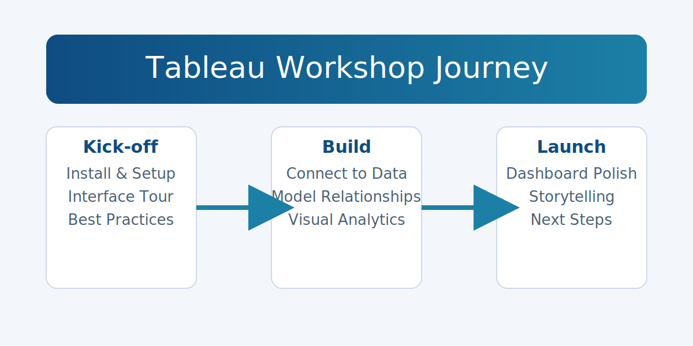

# Sales Dashboard Workshop

Welcome to the companion repository for the *Sales Dashboard* workshop delivered as part of the **Software Engineering for Data Science** course. This repository preserves the workshop assets, highlights the learning journey, and provides guidance on how to open and explore the Tableau and Power BI dashboards that were created live with the cohort.

## Workshop Story

Teaching is one of the fastest ways to solidify technical mastery. During this workshop I had the opportunity to guide 33 students through the complete lifecycle of building a sales analytics experience:

- **Installation & Setup** – installing Tableau Desktop, configuring the workspace, and understanding the project folder structure.
- **Connecting to Data Sources** – importing multiple CSV files, setting up joins and relationships, and verifying data quality checks.
- **Creating Robust Data Models** – defining hierarchies, calculated fields, parameters, and leveraging level of detail expressions.
- **Developing Insightful Visualizations** – designing charts with intent, applying color theory, and introducing advanced features such as quick table calculations.
- **Crafting Professional Dashboards** – assembling the visualizations into an interactive sales command center with actions, filters, and storytelling techniques.

The session culminated in the delivery of a polished sales dashboard that demonstrates how data visualization empowers business stakeholders to track KPIs, segment customers, and spot trends at a glance. The energy in the (virtual) room confirmed once again that learning by doing—and by teaching—creates the deepest understanding.

## Repository Contents

| File | Description |
| --- | --- |
| `Sales_Dashboard.twb` | Tableau workbook used during the live session. Contains worksheets, dashboard layouts, and example calculations. |
| `SalesDashboard.pbix` | Power BI version of the dashboard to showcase cross-platform storytelling. |
| `assets/` | Hand-crafted visuals that summarize the experience for README and presentation purposes. |

> **Note:** Sample data sources used during the workshop are not bundled in this repository. Replace the connections with your own data or point to the same file paths used in the session.

## Getting Started with Tableau

1. **Install Tableau Desktop** – Download a trial or use an academic license from [Tableau for Students](https://www.tableau.com/academic/students).
2. **Open the Workbook** – Launch `Sales_Dashboard.twb`. Tableau will prompt you to locate the data sources. Select the CSV or Excel files you want to analyze.
3. **Explore the Data Model** – Review the relationships pane to ensure joins and blends are configured correctly for your dataset.
4. **Interact with the Dashboard** – Use filters, highlights, and actions to explore sales by time, geography, and customer segment.
5. **Customize** – Adjust color palettes, swap out KPIs, or add new worksheets to tailor the dashboard to your business scenario.

## Getting Started with Power BI

1. **Install Power BI Desktop** from [Microsoft Download Center](https://www.microsoft.com/power-platform/products/power-bi/downloads).
2. **Open `SalesDashboard.pbix`** and connect to your data sources when prompted.
3. **Review the Model** using the model view to verify relationships, measures, and calculated columns.
4. **Experiment with Interactions** by selecting visuals and observing how cross-filtering reveals insights.
5. **Publish or Share** the report via Power BI Service to collaborate with teammates.

## Recreating the Demo

If you’d like to follow along from scratch:

1. **Gather a Sales Dataset** – any dataset with orders, customers, and product categories will work.
2. **Model the Data** – clean and normalize fields, then create calculated metrics such as total sales, average discount, and profit ratios.
3. **Prototype Visuals** – start with line charts for time trends, bar charts for categorical comparisons, and maps for geographic analysis.
4. **Assemble the Dashboard** – drag components onto the dashboard canvas, enable actions, and fine-tune the layout for readability.
5. **Tell the Story** – pair key metrics with annotations and narrative text to guide stakeholders to the most important insights.

## Reflection

Delivering this workshop reinforced the idea that mentorship accelerates growth. The enthusiastic questions from the cohort sparked deeper exploration into best practices, performance tuning, and storytelling techniques—making the learning loop mutually rewarding.

If you adapt the dashboard or run your own session, feel free to open an issue or share a link. I’d love to see how you extend the concepts! 🎉
